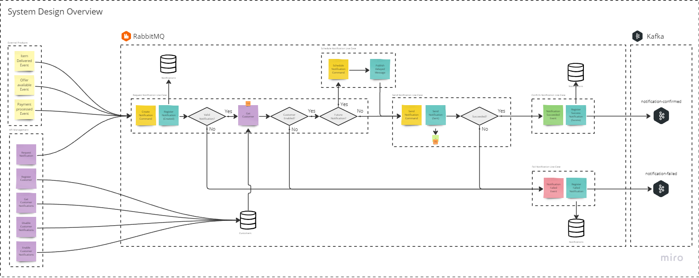

# MeLinforma
A notification solution built to be resilient, scalable and easy to use.

MeLinforma is a service to offer flexibility to send notification for one or more customers. Any 
productive service is able to integrate with MeLinforma, just sending requests to notify users and 
receiving feedback if each notification has been successfully processed or not.

## Overview

### Domain

Two entities were identified as part of Domain: **Notification** and **Customer**.

- **Notification**

    Notification is the main domain entity. Each request creates a notification, valid or not, but 
it will be sent to informed customer only if all notifications requirements were satisfied and customer 
is able to receive the notification. A notification can be immediately send or scheduled to 
a future datetime, according to informed value at 'SendAt'.

- **Customers**

    A customer may receive one or more notifications. A notification is effective forwarded to 
an existing customer if customer is with notifications enabled. Thus, customers can enable and disable 
notifications and also see them notification history.

### Use Cases

- **Notification**

    - **Request Notification**

      A notification can be requested making a HTTP request to an endpoint (if necessary, it can be
      directly published to a queue for  performance improvement, by simplicity HTTP request has been
      chosen). 
      
      Notifications can be schedule or not. To schedule a notification, its only necessary to attribute
      a future datetime to field 'SentAt' in request payload.

    - **Notification Failed**

      Notifications requests can be failed, but MeLinforma enqueues all failed messages an specific queues.
      A product can be informed the reason for failed notification requests. 

    - **Notification Confirmed**

      If everything be correct, MeLinforma enqueues notifications successfully and products can have sure
      that they messages are forwarded to the customer.

- **Customer**

    - **Create Customer**
        
      Every customer has an unique identifier attributed when created. This unique identifier is used
      to represent the user desired to notify while requesting a notification.
  
    - **Enable/Disable Notifications**

      Customers may not like to receive notifications, so they can request to enable or disable it.
  
    - **Notifications history**

      While an customer have notifications enabled, each notification received is also registered to
      a notification history. Somethings we do not have time enough to stop and see the notification
      at right time.

## Used Techniques

- Clean Architecture
- Domain Driven Design
- Event Driven Architecture
- CQRS
- Code First Database

## Used Technologies

- [C# (Programming Language)](https://learn.microsoft.com/en-us/dotnet/csharp/)
- [ASP.NET Core (Web Framework)](https://learn.microsoft.com/en-us/aspnet/core/?view=aspnetcore-7.0)
- [RabbitMQ (Message Broker)](https://www.rabbitmq.com/)
- [MassTransit (Messaging Framework)](https://masstransit.io/)
- [Postgresql (Database)](https://www.postgresql.org/)
- [Entity Framework Core (ORM)](https://learn.microsoft.com/pt-br/ef/core/)
- [SignalR (Realtime communication)](https://learn.microsoft.com/pt-br/aspnet/signalr/overview/getting-started/introduction-to-signalr)
- [Apache Kafka](https://docs.confluent.io/kafka/overview.html)

## Running Application

- Requirements
  - [.NET 7 SDK](https://dotnet.microsoft.com/pt-br/download/dotnet/7.0)
  - [Docker](https://www.docker.com/)
  - [Docker Compose](https://docs.docker.com/compose/)

- Steps
  - Clone the project repository
  - Navigate to 'MeLinforma' root folder
  - Start Docker
  - Run 'docker-compose up' command
  - In separated consoles:
    - dotnet run --project ./src/Workers/MeLinforma.Workers.csproj
    - dotnet run --project ./src/WebApi/MeLinforma.WebApi.csproj
  - Access the Swagger 
    - In a browser, open 'https://localhost:7051/swagger'
  - For each new desired customer client, in a separated console run:
    - dotnet run --project ./demo/Client/MeLinforma.Client.csproj